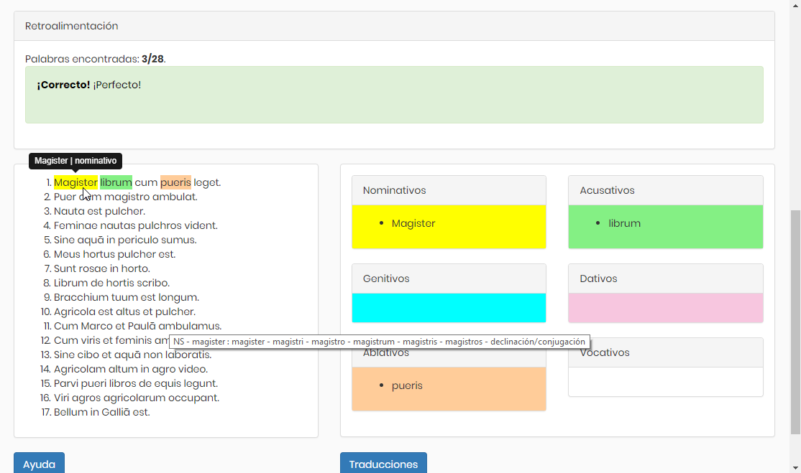

## Contenido

\tableofcontents

# ¿En qué orden aprender el contenido?

## ¿En qué orden aprender el contenido? 

### ¿En qué orden debería aprender en este microcurso? 
* Te recomendamos que sigas el orden de las páginas. 

* Así aprendes haciendo actividades y observando por ti mismo.

* Sin emabrgo, si absolutamente sabes que al principio quieres leer algunas cosas de la teoría y mirar las terminaciones, puedes empezar por la última página y proceder en orden inverso.

# El contenido de este microcurso

## Aprender a reconocer

### Oraciones sencillas 1

* Al principio aprendes a reconocer sustantivos y adjetivos de la segunda declinación en oraciones sencillas y en una historia corta en la sección _[\textcolor{blue}{Aprender a reconocer}](https://17kari.github.io/latin_la_segunda_declinacion/oraciones_sencillas_1.html)_.

* Al principio intenta entender las oraciones.

* Intenta econtrar los sustantivos y los adjetivos arrastrándolas en las cajas de los casos adecuados.

* Si tienes problemas entender alguna oración, puedes mirar las traducciones pulsando el botón _Traducciones_.
	- Véase la imagen de la interfaz de usuario en la siguiente transparencia

* Si tienes problemas detectar los sustantivos y los adjetivos y saber sus casos, puedes pulsar el botón _Ayuda_.

## Aprender a reconocer
### Interfaz de usuario  
\centering
{ width=100% }\

## Aprender a reconocer

### Oraciones sencillas 2

* _Oraciones sencillas 2_ es como _Oraciones sencillas 1_, solo las oraciones son distintas.

## Aprender a reconocer

### Una historia corta

* _[\textcolor{blue}{Una historia corta}](https://17kari.github.io/latin_la_segunda_declinacion/historia_corta.html)_ es como _Oraciones sencillas_, pero en vez de oraciones contiene una historia.

* Al principio intenta entender las oraciones.
	- Te hemos dado imágenes para facilitar el entendimiento. 
	- Al final, si no puedes entender bien, puedes mirar las traducciones.

* Si tienes problemas detectar los sustantivos y los adjetivos y saber sus casos, puedes pulsar el bóton _Ayuda_.

## Observar

### ¿Cuáles de las palabras tienen algo en cómun? 

* En la sección _[\textcolor{blue}{Observar}](https://17kari.github.io/latin_la_segunda_declinacion/nominativos.html)_ intentas notar cuáles de las palabras de _Oraciones sencillas_ pueden formar grupos.

* Avanzas caso por caso. 

* En el _Resumen_ haces observaciones de todos los casos y de sus terminaciones.

## Tabla de declinación

### Tabla de declinación 

* En _[\textcolor{blue}{Tabla de declinación}](https://17kari.github.io/latin_la_segunda_declinacion/tabla.html)_ concluyemos todas las terminaciones 
	- de todos los casos en singular y 
	- en plural.

* Y, sobre todo, haces más observaciones.

## Apuntes y observaciones

### Apuntes y observaciones 

* Al final en _[\textcolor{blue}{Apuntes y observaciones}](https://17kari.github.io/latin_la_segunda_declinacion/apuntes.html)_ te damos algunos apuntes de la segunda declinación. 

* Además, repetimos algunas cosas más importantes que probablemente has observado por ti mismo también.
