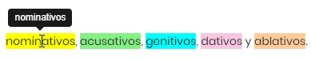

## Contenido

\tableofcontents

# Menú

## Menú 

### El uso del Menú 
* Puedes esconder el _Menú_ a la izquierda pulsando el botón _Menú_. 

* Es utíl especialmente cuando tienes 
	- una pantalla pequeña,  
	- espacio reducido o
	- no se ve algo bien o el placamiento del contenido va mejor con más espacio.

# Colores

## Los colores en este microcurso

### Colores

\small 

* En este microcurso usamos sistematicamente los mismos colores para los casos:
{ width=80% }\

* Si tienes problemas ver los colores, puedes ver los globos (tooltips) moviendo el cursor sobre las palabras.

* Además, en los globos te damos alguna información extra en algunos casos.

* Hay algunas cajas de colores en las que no existen globos. Lo sentimos, ya que sabemos que eso causa problemas a algunas personas. En el futuro añadiremos un botón con el que se puede desactivar todos los colores y ver todo el contenido en blanco y negro.

# Dispositivos

## Pantallas 

### Pantallas para usar este microcurso 

* Este microcurso es responsivo y funciona tanto con las pantallas grandes como con las pequeñas. 

* Sin embargo, arrastrar y soltar no funciona con una pantalla táctil. 

* También te recomendamos esconder el Menú si tienes una pantalla pequeña y usar el modo horizontal (landscape mode).
